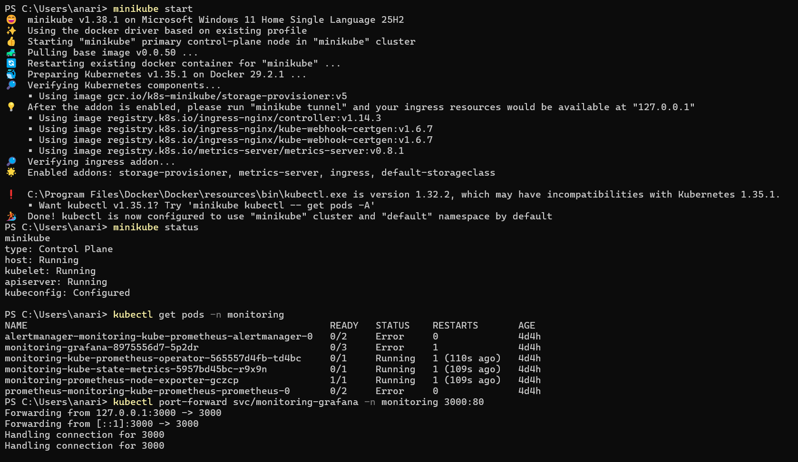
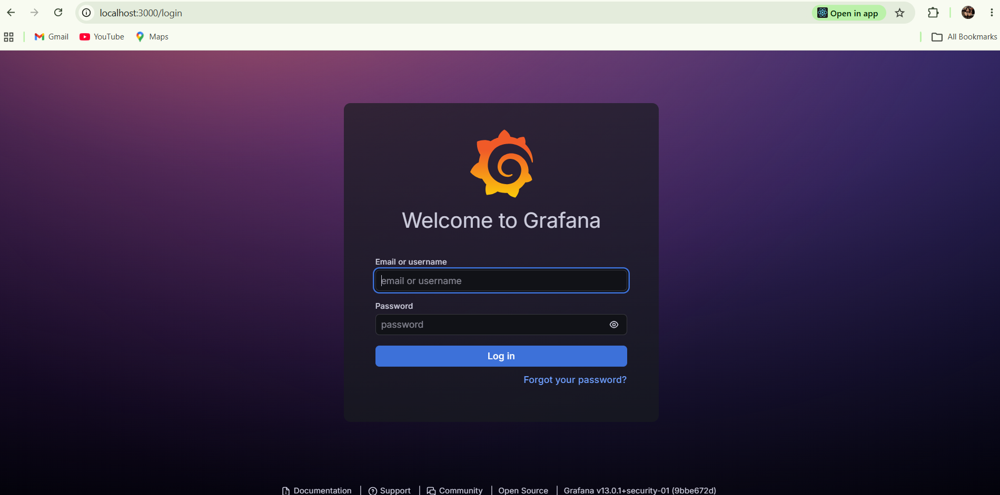

# 🚀 Kubernetes AutoScaling CI/CD Application on AWS EKS

A complete DevOps + Cloud project where a full-stack containerized application was deployed using Kubernetes, AWS EKS, monitoring tools, autoscaling, and GitHub integration.

---

# 📌 Project Overview

This project demonstrates:

- Docker containerization
- Kubernetes deployment
- AWS EKS cluster setup
- Horizontal Pod Autoscaling (HPA)
- Monitoring using Prometheus & Grafana
- GitHub integration
- CI/CD troubleshooting and deployment fixes

---

# 🛠️ Tech Stack

- Docker
- Kubernetes
- Minikube
- AWS EKS
- EC2
- Prometheus
- Grafana
- MongoDB
- React
- Node.js
- Git & GitHub

---

# 📌 Project Flow (Step by Step)

---

# ✅ Step 1 — Project Setup

Created a full-stack application structure:

- Frontend
- Backend API
- MongoDB Database

```md
C:\Users\anari\OneDrive\Pictures\Screenshots\Screenshot 2026-05-23 004849.png
```

---

# ✅ Step 2 — Docker Containerization

Dockerized all services:

- Frontend container
- Backend container
- MongoDB integration

### 📸 Screenshot

```md

```

---

# ✅ Step 3 — Kubernetes Deployment on Minikube

Deployed the application on Kubernetes using:

- Deployments
- Services
- ClusterIP
- NodePort

### 📸 Screenshot

```md

```

---

# ✅ Step 4 — Kubernetes Services

Verified Kubernetes services:

- backend-service
- mongo-service
- myapp-service

### 📸 Screenshot

```md

```

---

# ✅ Step 5 — Horizontal Pod Autoscaler (HPA)

Configured autoscaling using CPU utilization.

### 📸 Screenshot

```md

```

---

# ✅ Step 6 — AWS EKS Cluster Setup

Created AWS EKS cluster with:

- Managed Node Group
- EC2 Worker Nodes
- Networking configuration

### 📸 Screenshot

```md

```

---

# ✅ Step 7 — Node Group & EC2 Worker Nodes

Configured worker nodes for Kubernetes workloads.

### 📸 Screenshot

```md

```

### 📸 Screenshot

```md

```

---

# ✅ Step 8 — LoadBalancer Service

Exposed the application publicly using AWS LoadBalancer.

### 📸 Screenshot

```md

```

---

# ✅ Step 9 — Application Output

Successfully connected:

- Frontend
- Backend
- MongoDB

### 📸 Screenshot

```md

```

---

# ✅ Step 10 — Monitoring Setup

Installed monitoring stack using Helm:

- Prometheus
- Grafana
- Alertmanager
- Node Exporter

### 📸 Screenshot

```md

```

---

# ✅ Step 11 — Grafana Dashboard

Configured Grafana dashboard for Kubernetes monitoring.

### 📸 Screenshot

```md

```

---

# ✅ Step 12 — GitHub Integration

Pushed the complete project to GitHub repository.

### 📸 Screenshot

```md

```

---

# ✅ Step 13 — CI/CD Pipeline Debugging

Worked on multiple deployment and CI/CD fixes:

- Retry pipeline
- Auto deploy fix
- Git cleanup
- GitHub large file issue

### 📸 Screenshot

```md

```

---

# 🧠 Issues Solved During Project

- LoadBalancer DNS issue
- Grafana login failure
- Monitoring pod restart issue
- Port-forward connection refused
- GitHub push failed because of large files
- Kubernetes context mismatch
- EKS cluster deletion dependency issue
- AWS resource cleanup verification

---

# ⚙️ Useful Commands

## Kubernetes Pods

```bash
kubectl get pods
```

### 📸 Screenshot

```md

```

---

## Kubernetes Services

```bash
kubectl get svc
```

### 📸 Screenshot

```md

```

---

## Horizontal Pod Autoscaler (HPA)

```bash
kubectl get hpa
```

### 📸 Screenshot

```md

```

---

## Monitoring Namespace Pods

```bash
kubectl get pods -n monitoring
```

### 📸 Screenshot

```md

```

---

## Grafana Port Forward

```bash
kubectl port-forward svc/monitoring-grafana -n monitoring 3000:80
```

### 📸 Screenshot

```md

```

---

## Check Current Kubernetes Context

```bash
kubectl config current-context
```

### 📸 Screenshot

```md

```

---

## Switch Kubernetes Context

```bash
kubectl config use-context minikube
```

### 📸 Screenshot

```md

```

---

## AWS EKS Cluster List

```bash
aws eks list-clusters --region ap-south-1
```

### 📸 Screenshot

```md

```

---

## AWS EKS Nodegroup List

```bash
aws eks list-nodegroups --cluster-name aditi-cluster --region ap-south-1
```

### 📸 Screenshot

```md

```

---

## Git Status

```bash
git status
```

### 📸 Screenshot

```md

```

---

## Git Push

```bash
git push origin main
```

### 📸 Screenshot

```md

```

---

# 🔗 GitHub Repository

Repository:

https://github.com/IamAdii62/k8s-autoscaling-cicd-app

---

# 📌 Final Output

✔️ Full-stack application deployed successfully on Kubernetes  
✔️ Monitoring stack configured successfully  
✔️ HPA autoscaling working  
✔️ Application exposed using AWS LoadBalancer  
✔️ GitHub repository updated successfully  
✔️ AWS resources cleaned after project completion

---

# 📌 Author

Aditi Kumari  
Cloud Engineer | DevOps | Kubernetes | AWS | Docker
