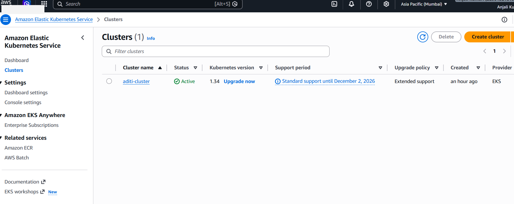

# ✅ Step 1 — Project Setup

---

# ✅ Step 2 — Docker Containerization

Dockerized all services:

- Frontend container
- Backend container
- MongoDB integration

---

# ✅ Step 3 — Kubernetes Deployment on Minikube

Deployed the application on Kubernetes using:

- Deployments
- Services
- ClusterIP
- NodePort

