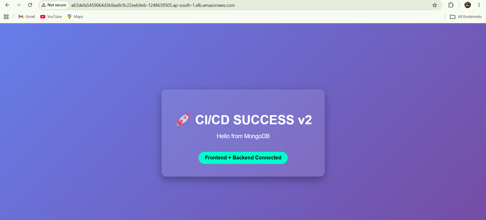
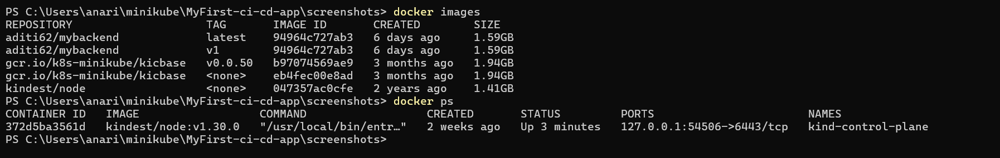
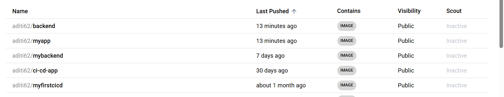
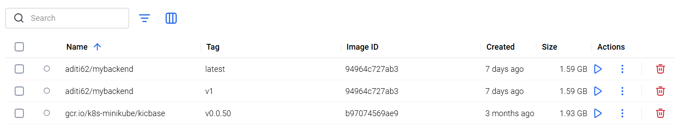
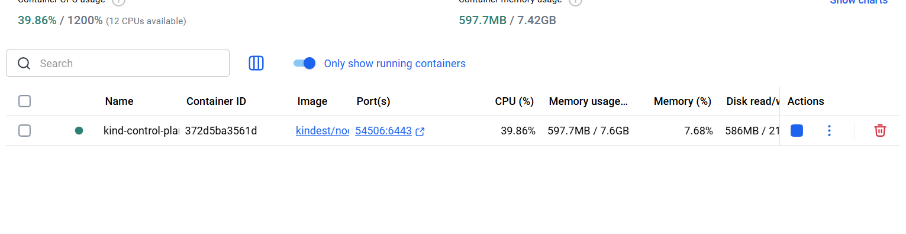
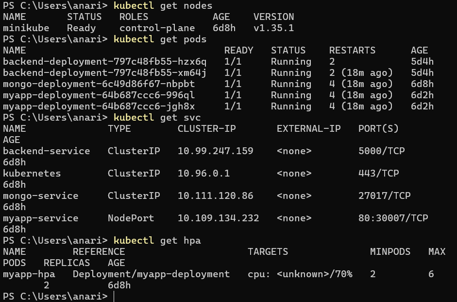
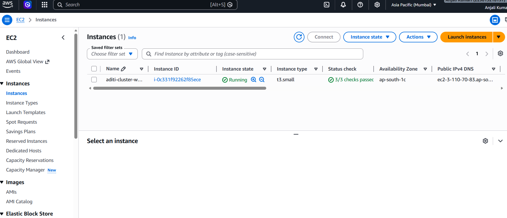
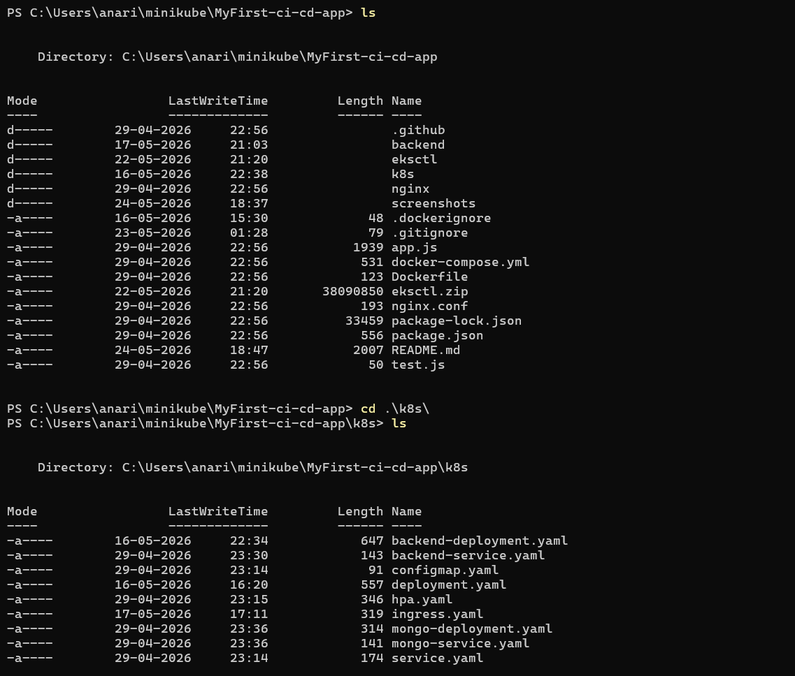

# 🚀 Kubernetes AutoScaling CI/CD Application on AWS EKS

A complete DevOps + Cloud project where a full-stack containerized application was deployed using Kubernetes, AWS EKS, monitoring tools, autoscaling, and GitHub integration.

---

# 📌 Project Overview

This project demonstrates:

- Docker containerization
- Kubernetes deployment
- AWS EKS cluster setup
- Horizontal Pod Autoscaling (HPA)
- Monitoring using Prometheus & Grafana
- GitHub integration
- CI/CD troubleshooting and deployment fixes

---

# 🛠️ Tech Stack

- Docker
- Kubernetes
- Minikube
- AWS EKS
- EC2
- Prometheus
- Grafana
- MongoDB
- React
- Node.js
- Git & GitHub

---

# 📌 Project Flow (Step by Step)

---

# ✅ Step 1 — Project Setup

Created a full-stack application structure:

- Frontend
- Backend API
- MongoDB Database

### 📸 Screenshot

---

# ✅ Step 2 — Docker Containerization

Dockerized all services:

- Frontend container
- Backend container
- MongoDB integration

---

# ✅ Step 3 — Kubernetes Deployment on Minikube

Deployed the application on Kubernetes using:

- Deployments
- Services
- ClusterIP
- NodePort

---

# ✅ Step 4 — Kubernetes Services

Verified Kubernetes services:

- backend-service
- mongo-service
- myapp-service

### 📸 Screenshot

# 📌 Final Output

✔️ Full-stack application deployed successfully on Kubernetes  
✔️ Monitoring stack configured successfully  
✔️ HPA autoscaling working  
✔️ Application exposed using AWS LoadBalancer  
✔️ GitHub repository updated successfully  
✔️ AWS resources cleaned after project completion

---

# 📌 Author

Aditi Kumari  
Cloud Engineer | DevOps | Kubernetes | AWS | Docker
